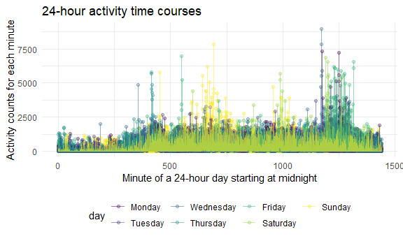

P8105 Homework 3
================
Ruiyang Li
2020-10-07

This is my solution to HW3.

## Problem 1

``` r
data("instacart")
```

Instacart is an online grocery service that provides online shopping
from local stores. For example, in New York City, such local partner
stores include Whole Foods, Fairway, and The Food Emporium. Normally,
orders will be delivered within 2 hours after placement.

The Instacart data consists of 1384617 rows of online grocery orders and
15 variables from 131209 Instacrat customers. In this dataset, each
customer has one or more orders, so the data is in the long format. Some
of the key variables include information on customers / orders such as
user ID, order ID, order day, and order hour, and information on
products such as name, aisle, and department.

  - There are 134 aisles. The most items are ordered from fresh
    vegetables aisles, which have 150609 orders.

<!-- end list -->

``` r
instacart %>% 
    count(aisle) %>% 
    arrange(desc(n))
## # A tibble: 134 x 2
##    aisle                              n
##    <chr>                          <int>
##  1 fresh vegetables              150609
##  2 fresh fruits                  150473
##  3 packaged vegetables fruits     78493
##  4 yogurt                         55240
##  5 packaged cheese                41699
##  6 water seltzer sparkling water  36617
##  7 milk                           32644
##  8 chips pretzels                 31269
##  9 soy lactosefree                26240
## 10 bread                          23635
## # ... with 124 more rows
```

  - The following plot shows the aisles with more than 10000 items
    ordered.

<!-- end list -->

``` r
instacart %>% 
    count(aisle) %>% 
    filter(n > 10000) %>% 
    mutate(
        aisle = factor(aisle),
        aisle = fct_reorder(aisle, n)
    ) %>% 
    ggplot(aes(x = aisle, y = n)) + 
    geom_point() + 
    theme(axis.text.x = element_text(angle = 90, vjust = 0.5, hjust = 1))
```


  - The next table shows the three most popular items in each of the
    aisles “baking ingredients”, “dog food care”, and “packaged
    vegetables fruits”.

<!-- end list -->

``` r
instacart %>% 
  filter(aisle %in% c("baking ingredients", "dog food care", "packaged vegetables fruits")) %>% 
  group_by(aisle) %>% 
  count(product_name) %>% 
  arrange(desc(n)) %>% 
  slice(1:3) %>% 
  ungroup() %>% 
  knitr::kable()
```

| aisle                      | product\_name                                 |    n |
| :------------------------- | :-------------------------------------------- | ---: |
| baking ingredients         | Light Brown Sugar                             |  499 |
| baking ingredients         | Pure Baking Soda                              |  387 |
| baking ingredients         | Cane Sugar                                    |  336 |
| dog food care              | Snack Sticks Chicken & Rice Recipe Dog Treats |   30 |
| dog food care              | Organix Chicken & Brown Rice Recipe           |   28 |
| dog food care              | Small Dog Biscuits                            |   26 |
| packaged vegetables fruits | Organic Baby Spinach                          | 9784 |
| packaged vegetables fruits | Organic Raspberries                           | 5546 |
| packaged vegetables fruits | Organic Blueberries                           | 4966 |

  - The table below shows the mean hour of the day at which Pink Lady
    Apples and Coffee Ice Cream are ordered on each day of the week.

<!-- end list -->

``` r
instacart %>% 
  filter(product_name %in% c("Pink Lady Apples", "Coffee Ice Cream")) %>% 
  group_by(product_name, order_dow) %>% 
  summarise(mean_hr = mean(order_hour_of_day)) %>% 
  pivot_wider(
    names_from = "order_dow",
    values_from = "mean_hr"
  ) %>% 
  knitr::kable()
## `summarise()` regrouping output by 'product_name' (override with `.groups` argument)
```

| product\_name    |        0 |        1 |        2 |        3 |        4 |        5 |        6 |
| :--------------- | -------: | -------: | -------: | -------: | -------: | -------: | -------: |
| Coffee Ice Cream | 13.77419 | 14.31579 | 15.38095 | 15.31818 | 15.21739 | 12.26316 | 13.83333 |
| Pink Lady Apples | 13.44118 | 11.36000 | 11.70213 | 14.25000 | 11.55172 | 12.78431 | 11.93750 |

“The Instacart Online Grocery Shopping Dataset 2017”, Accessed from
<https://www.instacart.com/datasets/grocery-shopping-2017> on June 24,
2017.

## Problem 2

  - Load, tidy, and wrangle the data.

<!-- end list -->

``` r
accel_df = 
  read_csv("./data/accel_data.csv") %>%
  janitor::clean_names() %>% 
    pivot_longer(
    activity_1:activity_1440,
    names_to = "minute",
    names_prefix = "activity_", 
    values_to = "activity"
  ) %>%
  mutate(
    minute = as.numeric(minute), 
    day_cat = ifelse(day %in% c("Saturday", "Sunday"), "weekend", "weekday"),
        day = factor(day, levels = c("Monday", "Tuesday", "Wednesday", "Thursday", "Friday", "Saturday", "Sunday"))) %>%
    relocate(week, day_id, day, day_cat)
## Parsed with column specification:
## cols(
##   .default = col_double(),
##   day = col_character()
## )
## See spec(...) for full column specifications.
```

This tidied accelerometer dataset contains 50400 observations and 6
variables. These variables include week, day, minute and activity counts
for each minute of a 24-hour day starting at midnight.

  - The following table shows the total activities for each day. There
    are much fewer activities on the Saturdays of week 4 and 5.

<!-- end list -->

``` r
accel_df %>% 
  group_by(week, day) %>% 
  summarize(activitiy_total = sum(activity)) %>% 
  knitr::kable()
## `summarise()` regrouping output by 'week' (override with `.groups` argument)
```

| week | day       | activitiy\_total |
| ---: | :-------- | ---------------: |
|    1 | Monday    |         78828.07 |
|    1 | Tuesday   |        307094.24 |
|    1 | Wednesday |        340115.01 |
|    1 | Thursday  |        355923.64 |
|    1 | Friday    |        480542.62 |
|    1 | Saturday  |        376254.00 |
|    1 | Sunday    |        631105.00 |
|    2 | Monday    |        295431.00 |
|    2 | Tuesday   |        423245.00 |
|    2 | Wednesday |        440962.00 |
|    2 | Thursday  |        474048.00 |
|    2 | Friday    |        568839.00 |
|    2 | Saturday  |        607175.00 |
|    2 | Sunday    |        422018.00 |
|    3 | Monday    |        685910.00 |
|    3 | Tuesday   |        381507.00 |
|    3 | Wednesday |        468869.00 |
|    3 | Thursday  |        371230.00 |
|    3 | Friday    |        467420.00 |
|    3 | Saturday  |        382928.00 |
|    3 | Sunday    |        467052.00 |
|    4 | Monday    |        409450.00 |
|    4 | Tuesday   |        319568.00 |
|    4 | Wednesday |        434460.00 |
|    4 | Thursday  |        340291.00 |
|    4 | Friday    |        154049.00 |
|    4 | Saturday  |          1440.00 |
|    4 | Sunday    |        260617.00 |
|    5 | Monday    |        389080.00 |
|    5 | Tuesday   |        367824.00 |
|    5 | Wednesday |        445366.00 |
|    5 | Thursday  |        549658.00 |
|    5 | Friday    |        620860.00 |
|    5 | Saturday  |          1440.00 |
|    5 | Sunday    |        138421.00 |

  - Here is a single-panel plot that shows the 24-hour activity time
    courses for each day, colored by day of the week. Based on this
    graph, it can be seen that Sunday has more activities in the middle
    of the day; Monday, Wednesday, Friday and Saturday have more
    activities close to the end of the day; activities are the lowest at
    the beginning and the end of a day.

<!-- end list -->

``` r
accel_df %>% 
    group_by(day, minute) %>% 
  ggplot(aes(x = minute, y = activity, color = day)) + 
    geom_point(alpha = 0.3) + 
    geom_line() + 
    labs(
    title = "24-hour activity time courses",
    x = "Minute of a 24-hour day starting at midnight",
    y = "Activity counts for each minute")
```


