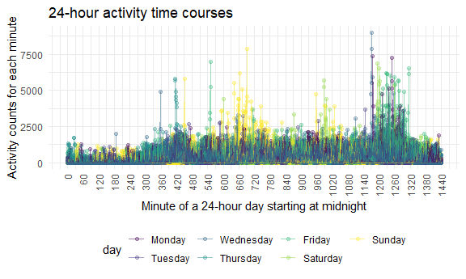
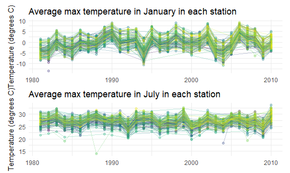

P8105 Homework 3
================
Ruiyang Li
2020-10-10

This is my solution to HW3.

## Problem 1

``` r
data("instacart")
```

Instacart is an online grocery service that provides online shopping
from local stores. For example, in New York City, such local partner
stores include Whole Foods, Fairway, and The Food Emporium. Normally,
orders will be delivered within 2 hours after placement.

The Instacart data consists of 1384617 rows of online grocery orders and
15 variables from 131209 Instacrat customers. In this dataset, each
customer has one or more orders, so the data is in the long format. Some
of the key variables include information on customers / orders such as
user ID, order ID, order day, and order hour, and information on
products such as name, aisle, and department.

  - There are 134 aisles. The most items are ordered from fresh
    vegetables aisles, which have 150609 orders.

<!-- end list -->

``` r
instacart %>% 
    count(aisle) %>% 
    arrange(desc(n))
## # A tibble: 134 x 2
##    aisle                              n
##    <chr>                          <int>
##  1 fresh vegetables              150609
##  2 fresh fruits                  150473
##  3 packaged vegetables fruits     78493
##  4 yogurt                         55240
##  5 packaged cheese                41699
##  6 water seltzer sparkling water  36617
##  7 milk                           32644
##  8 chips pretzels                 31269
##  9 soy lactosefree                26240
## 10 bread                          23635
## # ... with 124 more rows
```

  - The following plot shows the aisles with more than 10000 items
    ordered.

<!-- end list -->

``` r
instacart %>% 
    count(aisle) %>% 
    filter(n > 10000) %>% 
    mutate(
        aisle = factor(aisle),
        aisle = fct_reorder(aisle, n)
    ) %>% 
    ggplot(aes(x = aisle, y = n)) + 
    geom_point() + 
    theme(axis.text.x = element_text(angle = 90, vjust = 0.5, hjust = 1))
```


  - The next table shows the three most popular items in each of the
    aisles “baking ingredients”, “dog food care”, and “packaged
    vegetables fruits”.

<!-- end list -->

``` r
instacart %>% 
  filter(aisle %in% c("baking ingredients", "dog food care", "packaged vegetables fruits")) %>% 
  group_by(aisle) %>% 
  count(product_name) %>% 
  arrange(desc(n)) %>% 
  slice(1:3) %>% 
  ungroup() %>% 
  knitr::kable()
```

| aisle                      | product\_name                                 |    n |
| :------------------------- | :-------------------------------------------- | ---: |
| baking ingredients         | Light Brown Sugar                             |  499 |
| baking ingredients         | Pure Baking Soda                              |  387 |
| baking ingredients         | Cane Sugar                                    |  336 |
| dog food care              | Snack Sticks Chicken & Rice Recipe Dog Treats |   30 |
| dog food care              | Organix Chicken & Brown Rice Recipe           |   28 |
| dog food care              | Small Dog Biscuits                            |   26 |
| packaged vegetables fruits | Organic Baby Spinach                          | 9784 |
| packaged vegetables fruits | Organic Raspberries                           | 5546 |
| packaged vegetables fruits | Organic Blueberries                           | 4966 |

  - The table below shows the mean hour of the day at which Pink Lady
    Apples and Coffee Ice Cream are ordered on each day of the week.

<!-- end list -->

``` r
instacart %>% 
  filter(product_name %in% c("Pink Lady Apples", "Coffee Ice Cream")) %>% 
  group_by(product_name, order_dow) %>% 
  summarise(mean_hr = mean(order_hour_of_day)) %>% 
  pivot_wider(
    names_from = "order_dow",
    values_from = "mean_hr"
  ) %>% 
  knitr::kable()
## `summarise()` regrouping output by 'product_name' (override with `.groups` argument)
```

| product\_name    |        0 |        1 |        2 |        3 |        4 |        5 |        6 |
| :--------------- | -------: | -------: | -------: | -------: | -------: | -------: | -------: |
| Coffee Ice Cream | 13.77419 | 14.31579 | 15.38095 | 15.31818 | 15.21739 | 12.26316 | 13.83333 |
| Pink Lady Apples | 13.44118 | 11.36000 | 11.70213 | 14.25000 | 11.55172 | 12.78431 | 11.93750 |

“The Instacart Online Grocery Shopping Dataset 2017”, Accessed from
<https://www.instacart.com/datasets/grocery-shopping-2017> on June 24,
2017.

## Problem 2

  - Load, tidy, and wrangle the data.

<!-- end list -->

``` r
accel_df = 
  read_csv("./data/accel_data.csv") %>%
  janitor::clean_names() %>% 
    pivot_longer(
    activity_1:activity_1440,
    names_to = "minute",
    names_prefix = "activity_", 
    values_to = "activity"
  ) %>%
  mutate(
    minute = as.numeric(minute), 
    hour = rep(rep(c(rep(0,59),rep(1:23, each = 60),24), 7), 5), 
    day_cat = ifelse(day %in% c("Saturday", "Sunday"), "weekend", "weekday"),
        day = factor(day, levels = c("Monday", "Tuesday", "Wednesday", "Thursday", "Friday", "Saturday", "Sunday"))) %>%
    relocate(day_id, week, day, day_cat, hour)
## Parsed with column specification:
## cols(
##   .default = col_double(),
##   day = col_character()
## )
## See spec(...) for full column specifications.
```

This tidied accelerometer dataset contains 50400 observations and 7
variables. These variables include week, day, hour, minute and activity
counts for each minute of a 24-hour day starting at midnight.

  - The following table shows the total activities for each day. There
    are much fewer activities on the Saturdays of week 4 and 5.

<!-- end list -->

``` r
accel_df %>% 
    group_by(week, day) %>% 
  summarize(activitiy_total = sum(activity)) %>% 
    pivot_wider(
        names_from = "day", 
        values_from = "activitiy_total"
    ) %>% 
  knitr::kable()
## `summarise()` regrouping output by 'week' (override with `.groups` argument)
```

| week |    Monday |  Tuesday | Wednesday | Thursday |   Friday | Saturday | Sunday |
| ---: | --------: | -------: | --------: | -------: | -------: | -------: | -----: |
|    1 |  78828.07 | 307094.2 |    340115 | 355923.6 | 480542.6 |   376254 | 631105 |
|    2 | 295431.00 | 423245.0 |    440962 | 474048.0 | 568839.0 |   607175 | 422018 |
|    3 | 685910.00 | 381507.0 |    468869 | 371230.0 | 467420.0 |   382928 | 467052 |
|    4 | 409450.00 | 319568.0 |    434460 | 340291.0 | 154049.0 |     1440 | 260617 |
|    5 | 389080.00 | 367824.0 |    445366 | 549658.0 | 620860.0 |     1440 | 138421 |

  - Here is a single-panel plot that shows the 24-hour activity time
    courses for each day, colored by day of the week. Based on this
    graph, it can be seen that Sunday has more activities in the middle
    of the day; Thursday has more activities around 6am. Monday,
    Wednesday, Friday and Saturday have more activities close to the end
    of the day; activities are the lowest at the beginning and the end
    of a day.

<!-- end list -->

``` r
accel_df %>% 
    group_by(day_id, day, hour) %>% 
    summarise(activity_hr = sum(activity)) %>% 
    ggplot(aes(x = hour, y = activity_hr, color = day, group = day_id)) + 
    stat_smooth(se = FALSE, geom = "line", alpha = 0.8) + 
    labs(
    title = "24-hour activity time courses",
    x = "Minute of a 24-hour day starting at midnight",
    y = "Activity counts") + 
    scale_x_continuous(name = "Time (hour)",
                     limits = c(0, 24),
                     breaks = seq(0, 24, 6))
## `summarise()` regrouping output by 'day_id', 'day' (override with `.groups` argument)
## `geom_smooth()` using method = 'loess' and formula 'y ~ x'
```



## Problem 3

``` r
data("ny_noaa")

ny_noaa %>%
  select(-id, -date) %>% 
  summarise_all(list(~sum(is.na(.))))/nrow(ny_noaa)
##        prcp     snow      snwd      tmax      tmin
## 1 0.0561958 0.146896 0.2280331 0.4371025 0.4371264
```

This dataset was acquired from all New York state weather stations from
January 1, 1981 through December 31, 2010. It contains 2595176 rows and
7 columns. Each weather station has multiple dates of observation, so
the data is in the long format. There are precipitation variable, snow
variables (snowfall and snow depth) and temperature variables (maximum
temperature and minimum temperature). There is a lot of missing data in
this dataset, which could be an issue. 43.7% data was missing for both
temperature variables; 22.8% data on snow depth was missing; about 15%
data on snowfall was missing.

``` r
ny_noaa_tidy = 
    ny_noaa %>% 
    separate(date, into = c("year", "month", "day"), sep = "-") %>% 
    mutate(
        prcp = prcp/10,
        tmax = as.numeric(tmax),
        tmax = tmax/10, 
        tmin = as.numeric(tmin),
        tmin = tmin/10, 
        year = as.numeric(year),
        month = month.name[as.numeric(month)], 
        day = as.numeric(day)
    )

ny_noaa_tidy %>% 
    count(snow) %>% 
    arrange(desc(n))
## # A tibble: 282 x 2
##     snow       n
##    <int>   <int>
##  1     0 2008508
##  2    NA  381221
##  3    25   31022
##  4    13   23095
##  5    51   18274
##  6    76   10173
##  7     8    9962
##  8     5    9748
##  9    38    9197
## 10     3    8790
## # ... with 272 more rows
```

  - For snowfall, the most commonly observed values are 0 as it occurs
    2008508 times.

  - Below is a two-panel plot showing the average max temperature in
    January and in July in each station across years. It looks that the
    average max temperatures in 2010 were slightly higher than those in
    1981. Also, the average max temperatures in January in 2004 and 1994
    are much lower than those in the rest of the years. The average max
    temperatures in July looks to be less variable than that in January
    and the temperatures did not change much. There are a few outliers.
    There is one extreme value in 1981 in January and some others in
    1988, 2004, and 2007 in July. There seems to be one station has its
    values lower than the rest of the stations in July.

<!-- end list -->

``` r
avg_tmax_jan_plt = 
    ny_noaa_tidy %>% 
    filter(month %in% c("January")) %>% 
    group_by(id, year, month) %>% 
    summarise(avg_tmax = mean(tmax)) %>% 
    drop_na() %>% 
    ggplot(aes(x = year, y = avg_tmax, group = id, color = id)) + 
    geom_point(alpha = 0.3) + 
    geom_line(alpha = 0.3) +
    labs(
    title = "Average max temperature in January in each station",
    x = "Year",
    y = "Temperature (degrees C)") + 
    theme(legend.position = 'none',
        axis.title.x = element_blank())
## `summarise()` regrouping output by 'id', 'year' (override with `.groups` argument)

avg_tmax_jul_plt = 
    ny_noaa_tidy %>% 
    filter(month %in% c("July")) %>% 
    group_by(id, year, month) %>% 
    summarise(avg_tmax = mean(tmax)) %>% 
    drop_na() %>% 
    ggplot(aes(x = year, y = avg_tmax, group = id, color = id)) + 
    geom_point(alpha = 0.3) + 
    geom_line(alpha = 0.3) +
    labs(
    title = "Average max temperature in July in each station",
    x = "Year",
    y = "Temperature (degrees C)") + 
    theme(legend.position = 'none',
        axis.title.x = element_blank())
## `summarise()` regrouping output by 'id', 'year' (override with `.groups` argument)

avg_tmax_jan_plt / avg_tmax_jul_plt
```



  - The following two-panel plot shows (i) tmax vs tmin for the full
    dataset; and (ii) the distribution of snowfall values greater than 0
    and less than 100 separately by year.

<!-- end list -->

``` r
tmin_tmax_p = 
    ny_noaa_tidy %>% 
    ggplot(aes(x = tmin, y = tmax)) + 
    geom_hex() +
    theme(legend.direction = 'vertical', legend.position = "right")

snow_p = 
    ny_noaa_tidy %>% 
    mutate(year = as.character(year)) %>% 
    filter(snow > 0 & snow < 100) %>% 
    ggplot(aes(x = snow, y = year)) +
  geom_density_ridges(scale = .85)

tmin_tmax_p + snow_p
## Warning: Removed 1136276 rows containing non-finite values (stat_binhex).
## Picking joint bandwidth of 3.76
```


These data were accessed from the NOAA National Climatic Data Center,
<http://doi.org/10.7289/V5D21VHZ>, on August 15, 2017.(Menne, M.J., I.
Durre, B. Korzeniewski, S. McNeal, K. Thomas, X. Yin, S. Anthony, R.
Ray, R.S. Vose, B.E.Gleason, and T.G. Houston, 2012: Global Historical
Climatology Network - Daily (GHCN-Daily), Version 3.22.)
